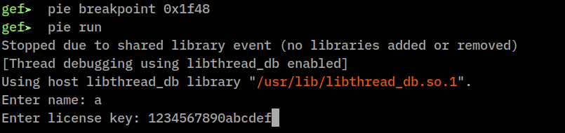
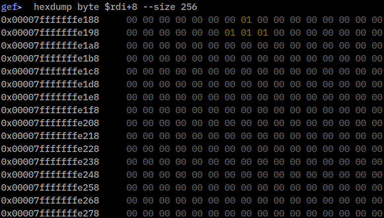
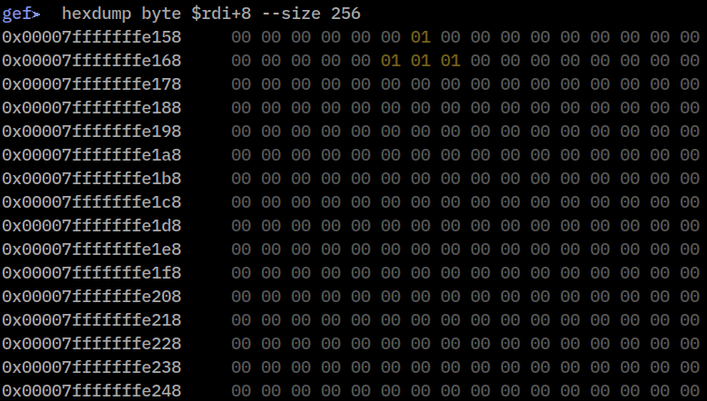
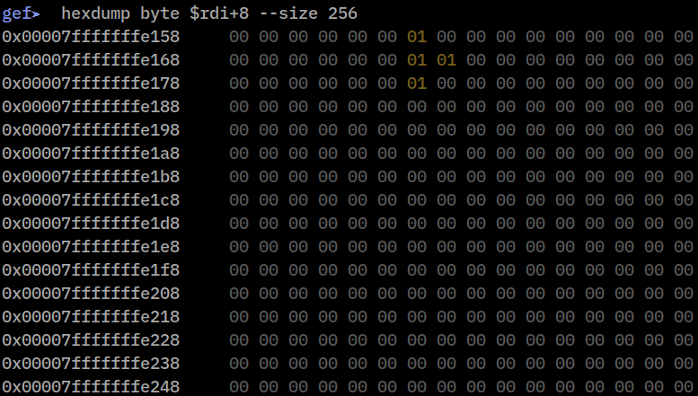
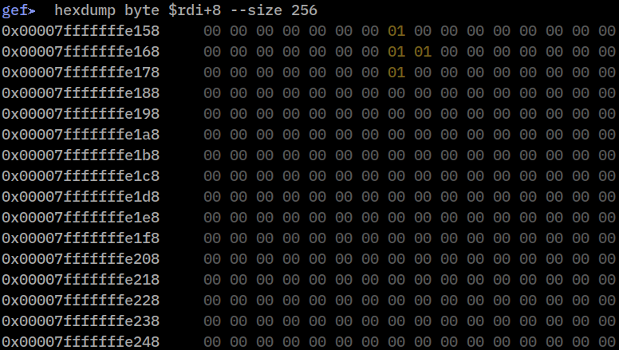
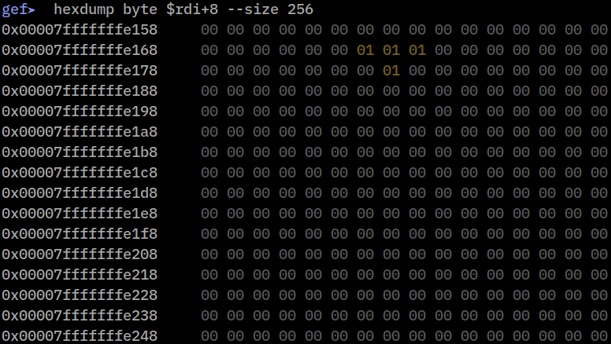
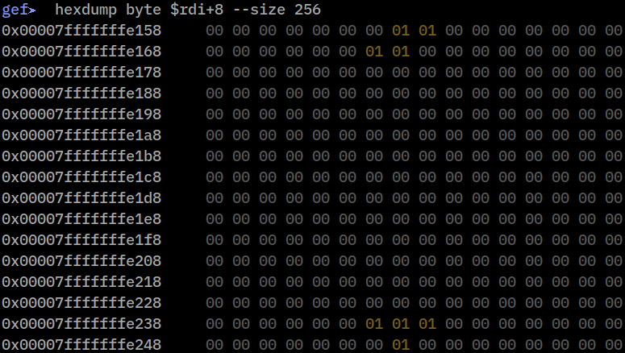
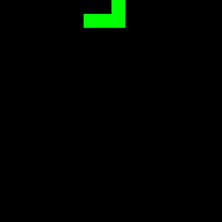

# License checker writeup

We load the binary in a disassembler/decompiler; here I'm using IDA Free. The main function starts off by reading user input into a name array and a license key array. These are passed to the function `sub_1399`, and if this returns something non-zero the flag is printed.

`sub_1399` in turn does some processing on the key. When cleaned up the code looks something like this:
```c
    for ( i = 0; key[i]; ++i )
    {
        key[i] = toupper(key[i]);
        if ( key[i] <= '/' || key[i] > '9' )
        {
            if ( key[i] <= '@' || key[i] > 'F' )
                return 0LL;
            digit = key[i] - '7';
        }
        else
        {
            digit = key[i] - '0';
        }
        key_pieces[num_key_pieces] = digit & 3;
        v3 = num_key_pieces + 1;
        num_key_pieces += 2;
        key_pieces[v3] = digit >> 2;
    }
```
We see that the key should consist of hexadecimal digits, and each digit is converted into two 2-bit "pieces" of some sort. Next we have this part:
```c
    v10 = 0LL;
    v11 = 0LL;
    v9[0] = sub_11E9;
    v9[1] = sub_12F6;
    v4 = sub_1348(name);
    sub_1EC1(v12, v9, v4);
    for ( j = 0; j < num_key_pieces; ++j )
    {
        if ( !sub_1F32(v12, key_pieces[j]) )
            return 0LL;
    }
    return v13 > 0;
```
Hmm. The "win condition" is `v13 > 0`, yet the local variable `v13` doesn't seem to be set anywhere. If we look closer at `v12`, IDA has made this into an array, *hence a pointer* (one of the bigger wtfs of the C language), so `sub_1EC1` and/or `sub_1F32` are probably modifying `v13` somehow, with `v12` really being a struct containing `v13`. Also `v9` seems to be a struct containing function pointers, with `v10` and `v11` part of the same struct (since they are not referred to anywhere else). All this might look a bit different in other versions of IDA or in other decompilers.

`sub_1348` does some calculations on the bytes in the passed in string, and returns a number. This looks like some sort of hashing algorithm. If you've seen this before you might recognize the [djb2](https://stackoverflow.com/questions/1579721/why-are-5381-and-33-so-important-in-the-djb2-algorithm) hash, if not a google search on the constants involved should tell you what it is. (It's not necessary to know the name of the hash function.)

Peeking inside `sub_11E9` and `sub_12F6` (including its call to `sub_121B`), two huge constants stick out (which again can be googled) used in what looks like an [LCG](https://en.wikipedia.org/wiki/Linear_congruential_generator). Probably `v9` is some struct keeping track of the RNG state and functionality. Based on this we create an rng struct with mostly placeholder fields:
```c
00000000 rng_t           struc ; (sizeof=0x28)
00000000 func1           dq ?
00000008 func2           dq ?
00000010 field_10        dq ?
00000018 field_18        dq ?
00000020 field_20        dq ?
00000028 rng_t           ends
```
Just by looking at the calls, `sub_1EC1` seems to initialize the `v12` struct given `v9` and the hash value `v4`, while `sub_1F32` will probably update `v12` (lets call it the "state") on each iteration based on the key "pieces". After some more renaming the code looks like this:
```c
    memset(&rng.field_10, 0, 0x18);
    rng.func1 = rng_func1;
    rng.func2 = rng_func2;
    name_hash = djb2(name);
    init_state(state, &rng, name_hash);
    for ( j = 0; j < num_key_pieces; ++j )
    {
        if ( !update_state(state, key_pieces[j]) )
            return 0LL;
    }
    return v11 > 0;
```
Ok. So we need to understand `init_state` and `update_state`, and probably the rng stuff at some point.

We also want to create a struct for the "state" variable. `init_state` will help us out here:
```c
    memset((void *)(state + 8), 0, 0x100uLL);
    *(_DWORD *)(state + 0x11C) = 0;
    *(_QWORD *)(state + 0x120) = a2;
    (*a2)(a2, a3);
    return sub_1D9B(state);
```
Based on this the struct should be at least 0x128 bytes big, with a 0x100 bytes buffer at offset 8. The `a2` value stored at offset 0x120 is a passed in pointer to the rng struct above. We create the following struct:
```c
00000000 state_t         struc ; (sizeof=0x128)
00000000 field_0         dq ?
00000008 buf             db 256 dup(?)
00000108 field_108       dq ?
00000110 field_110       dq ?
00000118 field_118       dd ?
0000011C field_11C       dd ? 
00000120 rng             dq ?
00000128 state_t         ends
```
If we go back to the "win condition" that was `v13 > 0`, this has now become `state.field_11C > 0`, so we rename that field to easily recognize it later.

It's important to create this struct early on to not go insane when you reverse the remaining functions, as most of them will use it heavily. Now we follow the state variable inside alle the functions called from `init_state` and `update_state`, remembering to retype all of them to `state_t *` if it's not already done by IDA. Look for simple "leaf" functions (functions that don't call other functions, or only call imported functions) that you can understand, and gradually build up to the more complex ones.

We will repeatedly see a double for loop of the form:
```c
    for ( i = ...; i < ...; ++i )
    {
        for ( j = ...; j < ...; ++j )
        {
            ...
            state->buf[0x10 * i + j] = ...;
            ...
        }
    }
```
This tells us that the `buf` field is really a 16x16 table/matrix, with `i` being the y coordinate and `j` the x coordinate. Now for instance `sub_190E` should make sense, which copies one 16-byte row in buf to another:
```c
void __fastcall copy_row(state_t *state, int src_y, int dst_y)
{
    _QWORD *row; // rcx
    __int64 v4; // rdx

    row = &state->buf[0x10 * dst_y];
    v4 = *(_QWORD *)&state->buf[0x10 * src_y + 8];
    *row = *(_QWORD *)&state->buf[0x10 * src_y];
    row[1] = v4;
}
```
Looking around the code it also looks like the only values used in `buf` are 0 and 1.

At some point we might notice that `sub_1955` changes the "win condition" field of the state struct:
```c
void __fastcall sub_1955(state_t *state)
{
    int v1; // [rsp+14h] [rbp-Ch]
    int y; // [rsp+18h] [rbp-8h]
    int y_4; // [rsp+1Ch] [rbp-4h]

    v1 = 0;
    for ( y = 0; y <= 0xF; ++y )
    {
        if ( is_row_all_ones(state, y) )
        {
            clear_row(state, y);
            for ( y_4 = y; y_4 > 0; --y_4 )
                copy_row(state, y_4 - 1, y_4);
            clear_row(state, 0);
            if ( ++v1 == 4 )
            {
                ++state->win_if_positive;
                v1 = 0;
            }
        }
        else
        {
            v1 = 0;
        }
    }
}
```
Here I've already reversed and given names to the functions used. This function goes through all the rows in `state->buf`, and each time it finds a row consisting only of ones, it goes through all the rows above it and copies them to the row below. Then it clears the top row. In effect this deletes the row with only ones and moves everything above it down by one row. After that it increases the "counter" `v1`, otherwise it sets `v1 = 0`. If `v1` reaches 4, we win (unless something else goes wrong before we return to the main loop in the program). So we want to somehow make four consecutive lines of only ones in the state->buf matrix. This might start to look familiar :thinking:

Tracing `sub_1955` back up, we see that it's called from the function I've called `key_piece_3` inside `update_state`:
```c
int __fastcall update_state(state_t *state, unsigned int key_piece)
{
    sub_1A17(state);
    if ( key_piece == 3 )
        return key_piece_3(state);
    if ( key_piece > 3 )
        return 0;
    if ( key_piece == 2 )
    {
        key_piece_2(state);
    }
    else if ( key_piece )
    {
        key_piece_1(state);
    }
    else
    {
        key_piece_0(state);
    }
    return sub_1BA7(state);
}
```
This means that every time we send in the value 3 as a 2-bit "key piece", the win-if-four-in-a-row thing will be checked. While we're here, `key_piece_1` and `key_piece_2` will just decrease/increase `state->field_0`, and we see this used as an x coordinate in `state->buf` other places in the code. `key_piece_0` is more mysterious. So we have four "operations" we can do with the license key: 1/2 will move left/right. 3 will do some stuff, clear "full" rows, and check for 4 consecutive "full" rows. 0 we don't know yet.

I often get lost in the static reversing and forget to run the program in a debugger. We should do that now. Let's put a breakpoint somewhere in `update_state` and look at how the `state->buf` matrix changes after each iteration. Let's use GDB with [GEF](https://github.com/hugsy/gef), and set a breakpoint on the call to `sub_1A17` at the start of `update_state`. Then `rdi` will contain the address of `state`, and `state->buf` will be at offset 8. Continuing with `c` and `hexdump byte $rdi+8 --size 256` a couple of times gives us:

 
<p float="left">
   
  
</p>
<p float="left">
   
  
</p>
<p float="left">
   
  
</p>

Ok, this is definitely a tetris game! Now we also know what all the operations do: move left/right, drop the piece (and clear lines/count tetrises), and rotate. The goal is to score four full lines in a row, known as a "tetris", by encoding moves (up until now called "key pieces") in the license key. We also notice that if we do any move that's "illegal", like moving out of the field or into blocks that are already filled, it just quits. Looking back at the main code we know that we are limited to 50 characters in the key, or 100 tetris moves.

But what about the RNG stuff? We can guess that it's used for picking the next tetris piece. Lets take a closer look. In `init_state` the function pointer `rng->func1` (which points to `sub_11E9 / rng_func1`) is called with the rng struct and the name hash passed as arguments. This sets some fields in the rng struct, so it looks like it initializes the RNG with the name hash as the seed. `rng->func2`, which is `sub_12F6 / rng_func2`, is called in `sub_1D9B`, and `sub_1D9B` is called at the end of `init_state` and at the end of `key_piece_3`. This has to be the function that returns a new RNG value, and it also fits that a new piece is chosen at the start of the game and after each drop of a piece.

```c
unsigned __int64 __fastcall rng_func2(rng_t *rng, unsigned __int64 a2)
{
    int v3; // [rsp+10h] [rbp-10h]
    int i; // [rsp+14h] [rbp-Ch]
    unsigned __int64 v5; // [rsp+18h] [rbp-8h]

    v3 = a2;
    for ( i = 1; ; ++i )
    {
        v3 >>= 1;
        if ( !v3 )
            break;
    }
    do
        v5 = sub_121B(rng, i);
    while ( v5 >= a2 );
    return v5;
}
```
`rng_func2` will first count the number of bits in the second argument, then repeatedly call `sub_121B` until we get a value that is smaller than this argument. So the second argument to `rng_func2` is a modulus / upper bound, and `sub_121B` is where the main RNG calculations happen. As mentioned earlier this is an LCG, and looking closer we see that it generates 64 new bits at a time, then use values from those bits until it needs to refill them. Cleaned up it will look something like this:
```c
unsigned __int64 __fastcall sub_121B(rng_t *rng, int bit_count)
{
    int bit_count_; // [rsp+0h] [rbp-1Ch]
    __int64 bits; // [rsp+14h] [rbp-8h]
    unsigned __int64 value; // [rsp+14h] [rbp-8h]

    bit_count_ = bit_count;
    bits = 0LL;
    if ( bit_count > rng->num_avail_bits )
    {
        bit_count_ = bit_count - rng->num_avail_bits;
        bits = rng->avail_bits << bit_count_;
        rng->state = 0x5851F42D4C957F2DLL * rng->state + 0x14057B7EF767814FLL;
        rng->avail_bits = rng->state;
        rng->num_avail_bits = 0x40;
    }
    value = rng->avail_bits & ~(0xFFFFFFFFFFFFFFFFLL << bit_count_) | bits;
    rng->avail_bits >>= bit_count_;
    rng->num_avail_bits -= bit_count_;
    return value;
}
```
Getting all this right in a reimplementation can be tricky, so it might be easier to just get the actual values from GDB when running the program. (Look up GDB scripting if you don't know about it already, so you don't have to manually extract the numbers for each different name you try.) We also need to know what values correspond to the different tetris pieces. We could reverse the details of `sub_1D9B`, where the RNG value is used as an index into the data defining each piece, or we could again read off the values in GDB and see which pieces are "drawn" by dumping the play field as above. 
 
Now we know enough to generate a valid name and license. There are several ways to solve this. We probably want to have at least parts of a 16x16 tetris game with the same RNG (or extracted RNG values) implemented in a convenient language, unless we try to hook into the actual game functions in the binary somehow. I think the easiest way is to find an implementation online (in say, python) and modify it so the play field size and RNG matches that in the binary. With this we can get fancy and write an automated tetris solver, searching for the best (or good enough) solution. Or we could just try and play it by hand while recording the moves. I solved it by hand, and after trying a handful of names I found one with a good enough seed to just barely make it within 100 moves:



I ended up with name / license = `qq / ba75755daaababaa7baaa345dd0a38aaa753555baaff751553`, but there are many other and better solutions.

